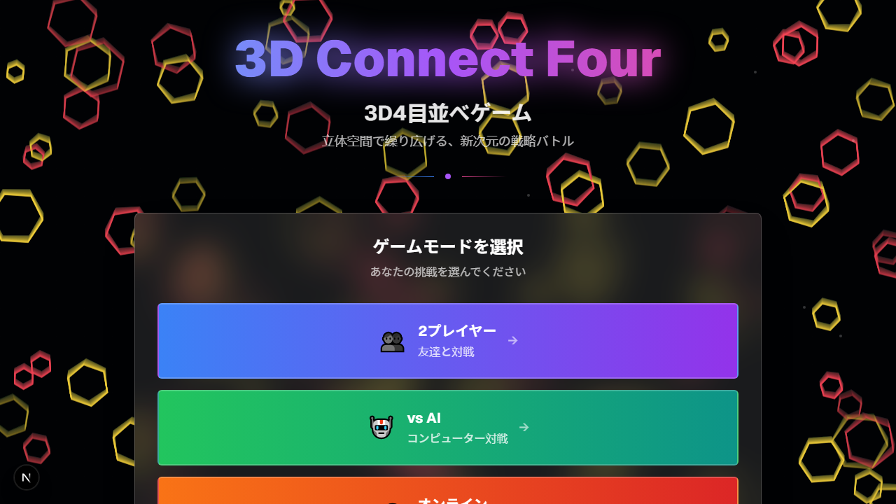

# 3D Connect Four

> **言語:** [English](README.md) · **日本語**

**4×4×4** の立方体盤面で遊ぶ立体版コネクトフォー。重力に従って (x, z) 列に駒を落とし、縦・横・奥行き・対角線を含む **全 13 方向** のいずれかで 4 つ並べたら勝ち。

Next.js 15 + React 19 + TypeScript + Three.js (`@react-three/fiber`) + Tailwind CSS で実装。**2 プレイヤー (同一画面)**, **vs AI** (3 段階の難易度), **オンライン対戦** (SSE) に対応。



---

## 特徴

- 🧊 **完全な 3D 盤面** — 64 マスの 4×4×4 立方体を Three.js / `@react-three/fiber` で描画。
- 🎯 **全 13 方向の勝利判定** — 行・列・縦積み・面対角・立体対角まで。
- 🤖 **ヒューリスティック AI** (簡単 / 普通 / 難しい) — 即勝ち手検出、相手のリーチブロック、ライン評価 + 1 手読み。
- 🌐 **オンライン対戦** — クイックマッチ / ルーム作成 / ID で参加。SSE で状態を配信。
- 💡 **リーチライン表示** — 自分の「あと 1 手で 4 連」を 3D ハイライト。相手には絶対に見せない設計。
- 🎨 **カスタマイズ** — プレイヤーごとの色変更、グリッド表示の ON/OFF、AI 難易度切り替え。
- 📱 **モバイル対応** — タッチ操作 (1 本指 = 回転 / 2 本指 = ズーム / タップ = 駒を置く)。

---

## クイックスタート

```sh
pnpm install
pnpm dev          # → http://localhost:3000
```

> このプロジェクトは **pnpm** で管理されています (`pnpm-lock.yaml`)。`npm install` を混ぜないでください — peer dependency の解決方式が違うので ERESOLVE エラーで詰みます。

### スクリプト

| コマンド                | 用途                                                   |
| ----------------------- | ------------------------------------------------------ |
| `pnpm dev`              | 開発サーバを起動 (Turbopack)                           |
| `pnpm build`            | 本番ビルド                                             |
| `pnpm start`            | 本番サーバを起動                                       |
| `pnpm lint`             | oxlint で静的解析                                      |
| `pnpm test`             | ユニットテスト (Vitest)                                |
| `pnpm test:e2e`         | E2E テスト (Playwright)                                |
| `pnpm docs:screenshots` | ユーザーマニュアル用のスクリーンショットを再生成        |

### 環境変数

| 変数名                 | 用途                                                                        |
| ---------------------- | --------------------------------------------------------------------------- |
| `NEXT_PUBLIC_SITE_URL` | OpenGraph / Twitter カード画像の絶対 URL 解決に使われる本番のオリジン。        |

---

## ゲームモード

| モード           | 説明                                                                                |
| ---------------- | ----------------------------------------------------------------------------------- |
| **2 プレイヤー** | 同じ画面で交互に着手するパスアンドプレイ。                                          |
| **vs AI**        | 3 段階の難易度。AI はすべてブラウザ内で動作。                                       |
| **オンライン**   | SSE によるリアルタイム対戦。クイックマッチ / ホスト / ルーム ID で参加。            |

操作方法と画面ごとの解説は [doc/user-manual.md](doc/user-manual.md) を参照。

---

## ディレクトリ構成

```
app/
├── layout.tsx              # ルートレイアウト + サイトメタデータ (OG / favicon)
├── icon.svg                # ファビコン
├── apple-icon.svg          # iOS ホーム画面用アイコン
├── page.tsx                # 画面ステートマシン (menu / playing / online-*)
└── api/game/               # オンライン対戦用 API (REST + SSE)
components/
├── title-page.tsx          # タイトル / モード選択
├── game-page.tsx           # ゲーム本体 (3D Canvas + UI)
├── online-menu.tsx         # クイック / 作成 / 参加 タブ
├── online-waiting.tsx      # ゲーム前の待機ルーム
└── ui/                     # shadcn/ui (Radix) プリミティブ
hooks/
└── useOnlineGame.ts        # SSE クライアント + REST ヘルパー
lib/
├── game-logic.ts           # 純粋な盤面ロジック (勝利判定・リーチ検出)
└── game-manager.ts         # サーバ側のルーム管理 (インメモリ)
tests/
├── unit/                   # Vitest
└── e2e/                    # Playwright
doc/
├── game.md                 # ゲームの内部仕様
├── user-manual.md          # エンドユーザー向けマニュアル
└── images/                 # マニュアルで使う画像
```

AI 開発エージェント (Claude Code, Codex, Cursor 等) 向けの詳細な設計メモは [AGENTS.md](AGENTS.md) を参照。

---

## オンライン対戦に関する注意

- ルームの状態は `lib/game-manager.ts` の **プロセス内シングルトン** に保持されます。**サーバ再起動で消えます**し、水平スケールにも追従しません。サーバレス本番環境にデプロイする場合は Redis 等の永続ストアに置き換える必要があります。
- リアルタイム配信は `app/api/game/[roomId]/events/route.ts` の **Server-Sent Events** で行います。クライアントは指数バックオフで最大 5 回まで再接続。
- 30 分非アクティブなルームは自動でガベージコレクションされます。

---

## 技術スタック

| 領域           | 採用技術                                                          |
| -------------- | ----------------------------------------------------------------- |
| フレームワーク | Next.js 15 (App Router)                                           |
| 言語           | TypeScript 5 (strict)                                             |
| UI             | React 19, Radix UI, Tailwind CSS, shadcn/ui                       |
| 3D             | Three.js, `@react-three/fiber`, `@react-three/drei`               |
| アイコン       | lucide-react                                                      |
| テスト         | Vitest (unit), Playwright (e2e + screenshot)                      |
| パッケージ管理 | pnpm                                                              |

---

## 由来

元は [v0.dev](https://v0.dev) で生成されたプロジェクトですが、その後手作業で大幅に書き直されています。
