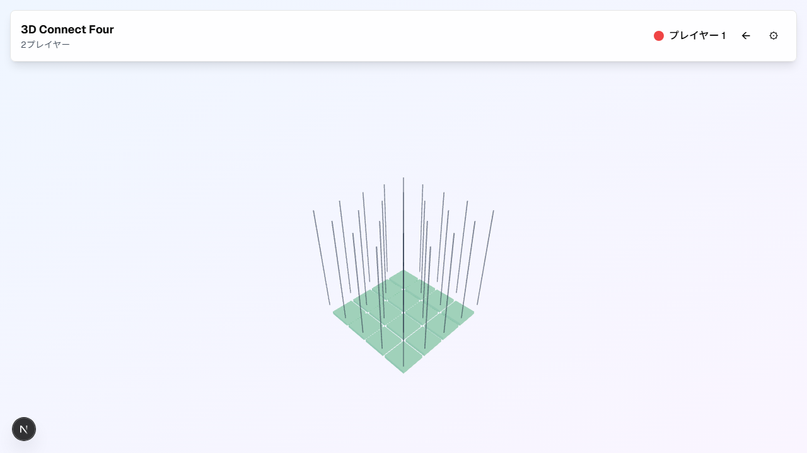
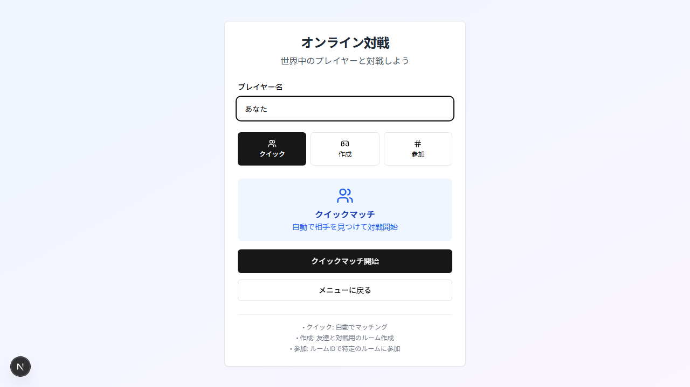
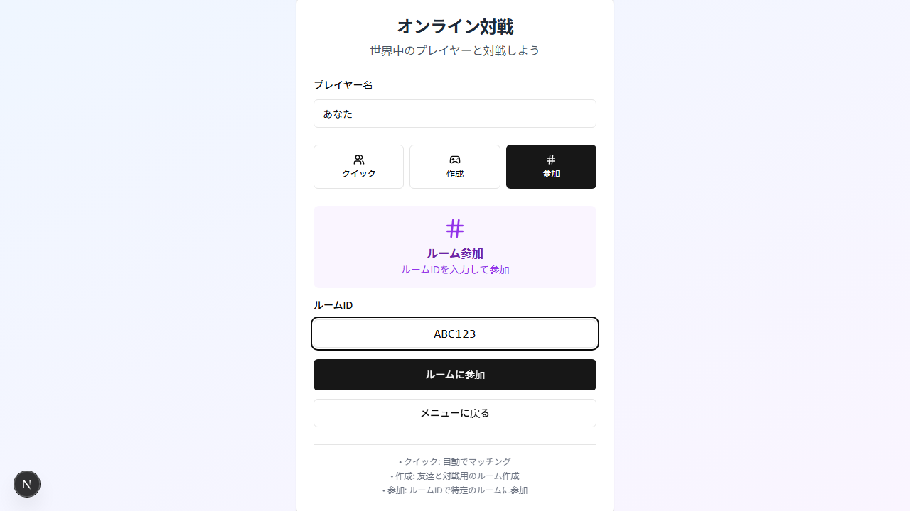
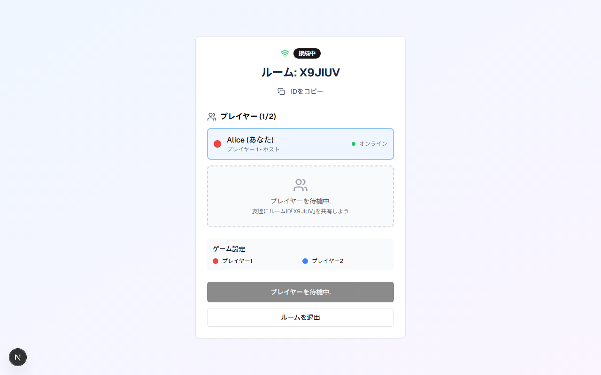
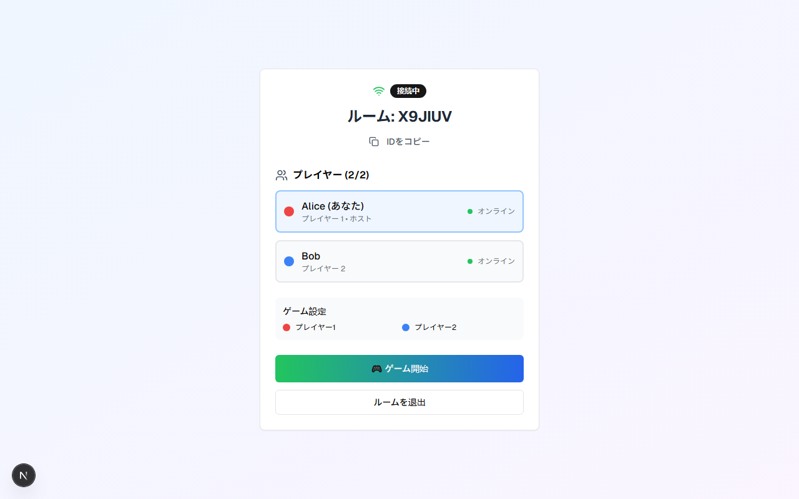
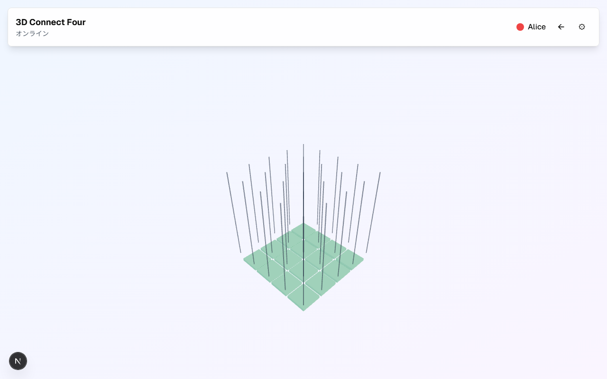
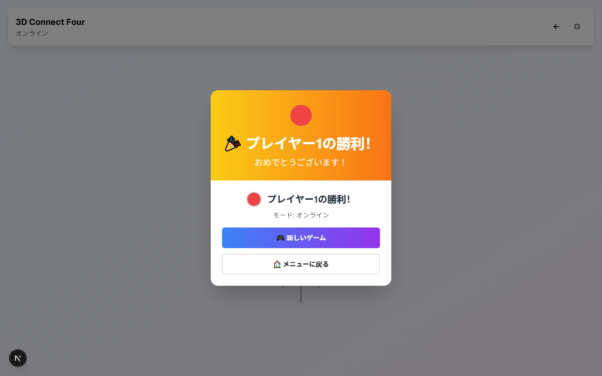

# 3D Connect Four — ユーザーマニュアル

立体空間 4×4×4 の盤面で 4 つ並べる「3D 4目並べ」。本書はプレイヤー向けの
操作ガイドです。ルール詳細は [doc/game.md](game.md) を参照してください。

> 画面スクリーンショットは [Playwright](../tests/screenshots/capture.spec.ts) で
> 自動取得・更新されています。最新化したいときは `pnpm docs:screenshots` を
> 実行してください (詳細は本書末尾)。

---

## 1. タイトル画面

ゲームを起動すると、まずタイトル画面が表示されます。


3 つのゲームモードから選んでクリックします。

| モード              | 内容                                              |
| ------------------- | ------------------------------------------------- |
| 👥 **2 プレイヤー** | 同じ画面で 2 人が交互に対戦                       |
| 🤖 **vs AI**        | コンピューター対戦 (難易度はゲーム中の設定で変更) |
| 🌐 **オンライン**   | サーバー経由で別端末のプレイヤーと対戦            |

下部の「遊び方」セクションには、立体盤面・全方向勝利判定・マウス操作の
基本ルールがまとめられています。

---

## 2. 2 プレイヤーモード

タイトルで「2 プレイヤー」を選ぶとすぐにゲームが始まります。



### 操作

- **盤面の回転** — 画面をドラッグするとカメラが旋回します。
- **ズーム** — マウスホイール / ピンチ。
- **着手** — 盤面の底面に表示される **緑色の半透明パネル** をクリック。
  そこから重力で駒が落ちて、その (x, z) 列の最も低い空きマスに積まれます。
- **手番交代** — 着手するたびにヘッダーの「現在のプレイヤー」表示が
  プレイヤー 1 ↔ 2 に切り替わります。

### ヘッダーのボタン

| アイコン | 動作                                                       |
| -------- | ---------------------------------------------------------- |
| `←`      | タイトル画面に戻る                                         |
| `⚙`      | 設定パネル (色・駒の形状・グリッド表示・リーチ表示) を開く |

---

## 3. vs AI モード

「vs AI」を選ぶとコンピューター (プレイヤー 2) との対戦が始まります。


ヘッダーには `vs AI (普通)` のように難易度バッジが表示されます。

### 難易度の挙動

| 難易度    | おおまかな挙動                                              |
| --------- | ----------------------------------------------------------- |
| 🟢 簡単   | 50% の確率で完全ランダム。相手のリーチを 30% の確率で見逃す |
| 🟡 普通   | 自分の勝ち手は必ず打つ。相手のリーチも基本的に止める        |
| 🔴 難しい | ライン評価 + 相手の脅威評価まで考慮して 1 手先読み相当      |

AI の思考中は底面パネルが **灰色** に変わり、操作不能になります。
ヘッダーには `(思考中...)` と表示されます。

---

## 4. オンライン対戦

タイトルで「オンライン」を選ぶとマッチング画面が開きます。



まず **プレイヤー名** を入力します (1〜20 文字)。次にタブで方式を選びます。

### 4.1 クイックマッチ

「クイックマッチ開始」を押すと、待機中のルームがあれば自動で参加し、
無ければ新しいルームを作って待機します。**友達と遊ばずすぐ対戦したい時** に。

### 4.2 ルーム作成

「作成」タブで「ルーム作成」を押すと、6 文字の英数字 ID (`X9JIUV` など) を持つ
新しいルームを作り、ホストとして待機画面に入ります。

### 4.3 ルーム参加

「参加」タブを開くと **ルーム ID 入力欄** が現れます。



ホストから共有された ID を入力して「ルームに参加」を押すと、そのルームに
ゲストとして入室します。

ルームが存在しない / 既に満員 (2 人) の場合は赤いエラーが表示されます。

---

## 5. 待機ルーム

ルームを作成または参加すると待機画面に入ります。

### 5.1 1 人だけのとき



- 上部にルーム ID とコピーボタン (`IDをコピー`) があります。友達に共有して
  ください。
- 接続状態は左上の `接続中` バッジ (緑のアンテナ) で確認できます。
- 2 人目を待っている間、開始ボタンは無効化されています。

### 5.2 2 人揃ったとき



両プレイヤーがリスト表示され、緑色のグラデーションの **「ゲーム開始」** が
有効になります。**ホスト・ゲストどちらが押しても OK** です。

「ルームを退出」を押すとタイトル画面に戻ります。

> **接続状態** — 各プレイヤーの右側に「オンライン (緑)」「オフライン (赤)」が
> 表示されます。相手がタブを閉じると数秒以内にオフラインに切り替わります。

---

## 6. オンライン対戦中

「ゲーム開始」を押すと両クライアントが同時にゲーム画面へ遷移します。



- ヘッダーに **`オンライン`** モードバッジと、現在の手番プレイヤー名 (例:
  `Alice`) が表示されます。
- 自分の手番でないときに底面パネルをクリックしても、サーバー側で拒否される
  ため駒は置かれません。
- 着手は **サーバー → SSE で全クライアントに反映** されるので、相手の手は
  数百ミリ秒以内に画面に現れます。
- 切断時は左上のアンテナアイコンが赤くなり、自動で再接続を試みます (最大 5 回、
  指数バックオフ)。

---

## 7. 勝利と再戦

4 つ並んだ瞬間に勝利モーダルが表示されます。



- **🎮 新しいゲーム** — 同じプレイヤー構成で再戦します。
- **🏠 メニューに戻る** — タイトル画面に戻ります。

オンライン対戦の勝敗判定は **サーバー側 (`lib/game-logic.ts`)** で行うため、
両クライアントが必ず同じ結果を見ます。勝敗確定後の追加着手はサーバーが
拒否します。

---

## 8. キーボード / マウス操作まとめ

| 操作                 | 効果                     |
| -------------------- | ------------------------ |
| 盤面の上でドラッグ   | カメラを旋回             |
| マウスホイール       | ズーム                   |
| 底面パネルをクリック | その (x, z) 列に駒を投入 |
| ヘッダー `←`         | タイトルに戻る           |
| ヘッダー `⚙`         | 設定パネル開閉           |

---

## 9. スクリーンショットの更新方法 (開発者向け)

本書の画像は実アプリを Playwright で操作して取得しています。

```sh
# 1) dev サーバはスクリプトが自動起動するので事前準備不要
pnpm docs:screenshots
```

実行内容:

- `playwright.screenshots.config.ts` を使って `tests/screenshots/capture.spec.ts`
  を実行
- `pnpm next dev --port 3100` を内部で起動
- `doc/images/*.png` を上書き

UI が変わったらこのコマンドを再実行し、生成された PNG を git にコミット
すれば本マニュアルが最新化されます。
